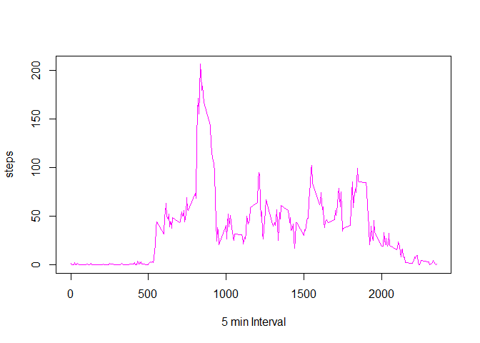

## Loading and preprocessing the data

```r
library(knitr)
library(ggplot2)

DatasetURL <- "https://d396qusza40orc.cloudfront.net/repdata%2Fdata%2Factivity.zip"
DatasetZip <- "repdata_data_activity.zip"
DatasetFile <- "activity.csv" 

# Check if the dataset already exists / downloaded. If not, then download the file
if (!file.exists(DatasetFile)) {
        download.file(DatasetURL, DatasetZip)
        unzip(DatasetZip)
}

activity_data <- read.csv(DatasetFile)
```


## What is mean total number of steps taken per day?

```r
MeanValue <- mean(activity_data$steps, na.rm=TRUE)
```
The answer is: 37.3825996

## What is the average daily activity pattern?

```r
daily_avg <- aggregate(steps ~ date, activity_data, mean, na.rm=TRUE)

#Plot daywise average activity, and draw a liner regression line to identify a pattern
#qplot(date, steps, data=daily_avg) + geom_smooth(method="lm")
plot1 <- ggplot(daily_avg, aes(date, steps)) + geom_point() + geom_smooth()
print(plot1)
```

```
## `geom_smooth()` using method = 'loess' and formula 'y ~ x'
```

<!-- -->


## Imputing missing values


## Are there differences in activity patterns between weekdays and weekends?
